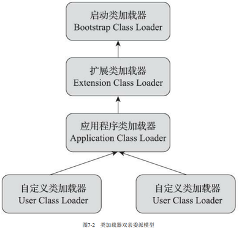

# 类加载器

Java虚拟机设计时有意将类加载阶段中的“通过一个类的全限定名来获取描述该类的二进制字节流”放到虚拟机外部去实现，以便让应用程序自己觉得如何去 获取所需的类。具体的实现就是类加载器。

## 类与类加载器
类加载器只用于实现类的加载，但在Java程序中的作用远超类加载。**对于任一一个类，都必须由它的类加载器和类本身共同确定在虚拟机中的唯一性**，也就是说即使是同一个类，如果是被不同的类加载器加载，那么这两个类也是不相等的。这里的相等包括类的Class对象的equals方法、isAssignableFrom()和isInstance方法的返回结果，也包括使用instanceof做判断的情况。
## 类加载器与双亲委派
### 类加载器
在Java虚拟机的角度，只有两种类加载器：启动类加载器(BootStrap ClassLoader，在HotSpot中由C++实现)，属于虚拟机的一部分；另一种就是其他，包括扩展类加载器和系统类加载器也属于其他，这些类加载器都由Java实现，独立于虚拟机外部，并且全都继承自抽象类java.lang.ClassLoader。
从开发人员的角度来看，类加载器从JDK 1.2到JDK 8一直都是三层类加载器、双亲委派的类加载架构。JDK 9的模块化对此有一点影响，但并未改变主体结构。
三层类加载器分别是：

- 启动类加载器(Bootstrap ClassLoader)：这个类加载器**负责加载存放在&lt;JAVA_HOME&gt;\lib目录，或者-Xbootclasspath参数所指定的路径中存放的类库至虚拟机内存(前提是这些类库能被Java虚拟机识别)**。启动类加载器无法被Java程序直接引用，用户在编写自定义类加载器时如果需要把加载请求委派给引导类加载器(就是启动类加载器)处理，直接使用null代替即可。
- 扩展类加载器(Extension ClassLoader)：这个类加载器在类sun.Launcher$ExtClassLoader中以Java代码实现。**负责加载&lt;JAVA_HOME&gt;\lib\ext目录中的，或者被java.ext.dirs系统变量所指定的路径中所有的类库**。该类加载器是Java系统类库的扩展机制，JDK开发团队允许用户将具有通用性的类库放在ext目录里以扩展Java SE的功能，在JDK 9之后，之中扩展机制被模块化的天然扩展能力取代。因为扩展类加载器由Java代码实现，所以**开发人员可以直接在程序中使用扩展类加载器来加载Class文件**。
- 应用程序类加载器(系统类加载器)：这个类加载器由sun.misc.Launcher$AppClassLoader实现。因为其是ClassLoader类中的getSystemClassLoader的返回值，所有也被称为系统类加载器。负责加载用户类路径(Class Path)下的所有类库，可以直接在代码中使用。如果开发人员没有在程序中自定义类加载器，系统类加载器就是程序中默认的类加载器。

### 双亲委派
双亲委派模型要求除了顶层的启动类加载器外，所有的类加载器都应当有自己的父类，不过这里所说的父子关系一般不通过继承来实现，而是通过组合来复用父加载器的代码。
双亲委派模型的工作过程是：如果一个类加载器收到一个类加载器请求，会先委托自己的父类加载器去完成，所以所有的加载请求都会委托到启动类加载器来完成，只有父类无法完成这个加载请求时（他的搜索范围内没有找到所需的类），子类加载器才会尝试自己去完成加载。
双亲委派可以防止全限定名重复的类加载出现问题， 如用户自己也编写了一个名为java.lang.Object的类，并放在程序的ClassPath中，那系统中就会出现多个不同的Object类，Java类型体系中最基础的行为也就无从保证。 
##### 

