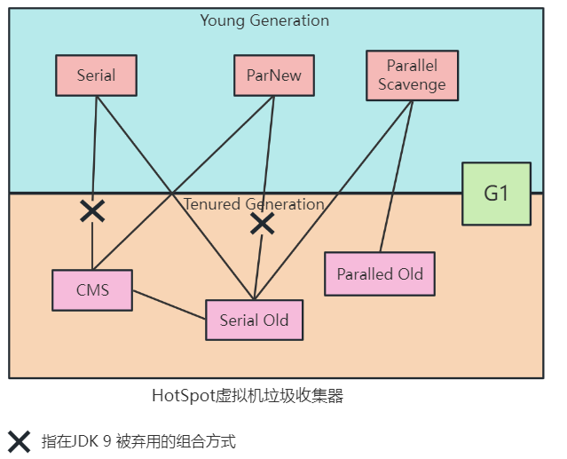

---
title: 垃圾收集器与内存分配
author: 陈生
date: '2023-08-28'
---##
 对象消亡判定
### 引用计数法
 在对象中添加一个引用计数器，每当有一个地方引用它时，计数器值就加一；当引用失效时，计数器值就减一。 虽然占用了一些额外的内存空间来进行计数，但它的原理简单，判定效率也很高。**但是单纯的引用计数器无法解决循环引用的问题**。
### 可达性分析
 基本思路就是通过一系列称为“GC Roots”的根对象作为起始节点集，从这些节点开始，根据引用关系向下搜索，搜索过程所走过的路径称为“引用链”（Reference Chain），**如果某个对象到GC Roots间没有任何引用链相连， 或者用图论的话来说就是从GC Roots到这个对象不可达时，则证明此对象是不可能再被使用的**。  
在Java中固定可作为GC Roots的对象包括以下几种：

- 在虚拟机栈中（局部变量表）引用的对象。 如各个线程被调用的方法堆栈中使用到的参数、局部变量、临时变量等。
- 方法区中类静态属性引用的对象。如Java类的引用类型静态变量。
- 方法区中常量引用的对象。如StringTable里的引用。
- 本地方法栈中JNI(即Native方法)引用的对象。
- 虚拟机内部的引用。如基本数据类型对应得Class对象，常驻异常对象等，还有系统类加载器。
- 所有被同步锁(Synchronized)持有的对象
- 反映虚拟机内部情况的JMXBean、JVMTI中注册的回调、本地代码缓存等。

除此之外，根据垃圾收集器和回收区域的不同，还有其他的对象作为GC Roots临时加入。如在进行分代回收或局部回收时，必须考虑某个区域的对象可能被其他区域的对象引用，这时候关联区域的对象也要加入GC Roots中。
主流的垃圾收集器都具备局部回收的特征，为了避免GC Roots过多在实现上也做了[各种优化](111)。
## 确定死亡
要真正确定一个对象死亡，需要经过两次标记过程。当对象经过可达性分析发现不可达后，它会被第一次标记。随后会进行筛选，如果重写了finalize()，如果该finalize方法还没有被调用过，那么对象可以在该方法内将自己赋给别人引用来救活自己。**finalize()**只能被调用一次，也就是说最多复活一次。
**都说不推荐使用这个方法，所有finalize可以做到的try-finally都可以做的更好，可以选择忘记这个方法。**
## 回收方法区
《Java虚拟机规范》提到不要求虚拟机在方法区中实现垃圾收集，如JDK 11中的ZGC收集器就不支持类卸载。方法区垃圾收集性价比通常不高。
方法区的垃圾收集主要回收两部分：

1. 废弃的常量
2. 不再使用的类型
:::info
举个常量池中字面量回收的例子，如果一个字符串“Java”曾经进入常量池中，但是系统没有任何一个字符串对象的值时“Java”，即已经没有任何字符串对象引用常量池中的“Java”常量，且虚拟机中也没有其他地方引用这个字面量。如果这时发生内存回收，而且垃圾收集器判断确有必要的话，这个“Java”常量就会被系统清理出常量池。常量池中的其他类、接口、方法、字段的符号引用也类似。
:::
	判定一个类型是否属于“不再被使用的类”就比较苛刻，需要同时满足在一下三个条件：

1. 该类的所有实例都已被回收，即Java堆中不存在该类及其任何派生子类的实例。
2. 加载该类的类加载器已被回收，这个条件通常很难达成。
3. 该类对应的java.lang.Class对象没有在任何地方引用，无法在任何地方通过反射访问该类的方法。

Java虚拟机被允许对满足上述三个条件的类进行回收，“被允许”的意思是不一定没有引用就必然被回收。
>  关于是否要对类型进行回收，HotSpot虚拟机提供了Xnoclassgc参数进行控制，还可以使用-verbose：class以及-XX：+TraceClass-Loading、-XX： +TraceClassUnLoading查看类加载和卸载信息，其中-verbose：class和-XX：+TraceClassLoading可以在 Product版的虚拟机中使用，-XX：+TraceClassUnLoading参数需要FastDebug版的虚拟机支持。

在大量使用反射、动态代理、CGLib等字节码框架，动态生成JSP以及OSGi这类频繁自定义类加载器的场景，通常需要虚拟机具有类卸载的能力，以保证不会对方法区造成过大的内存压力。

## 垃圾收集算法
忽略引用计数器式垃圾收集（直接垃圾收集），主要介绍追踪式垃圾收集（间接垃圾收集）的算法。
### 分代收集理论
分代收集名为理论，实际上是一套复合大多数程序运行实际情况的经验法则，建立在两个假说之上：

- 弱分代假说：绝大多数对象都是朝生夕死的
- 强分代假说：熬过越多次垃圾收集的对象就越难以消亡

根据假说，朝生夕死的对象应该放置在同一个区域，回收时只关注如何保留少量的存活对象。而对于难以消亡的对象，放在另一个低频率回收的区域。由此产生了"Minor GC"、"Major GC"、"Full GC"的概念，同时也发展出"标记-复制算法"、"标记-清除算法"和"标记-整理算法"。
在HotSpot虚拟机中，分为新生代和老年代，对应IBM J9的婴儿区(Nersery)和长存区(Tunured)，含义是相同的。由此产生的分代收集最明显的困难是：**对象不是孤立的、对象之间会存在跨代引用**。
例如进行一次Minor GC对新生代的区域进行收集，而新生代的对象是可能被老年代的对象引用的，为了找出该区域的存活对象，除了传统的GC Roots外，还需要遍历老年代中的所有对象来确保可达性分析结果的正确性，而这样的开销是巨大的，为了降低这种开销，还有第三条经验法则：

- 跨代引用假说：跨代引用相对于同代引用仅占极少数。

这是前两天假说的隐含推论：具有互相引用关系的两个对象应该倾向于同时生存同时消亡的。 
:::info
举个例子，如果某个新生代对象存在跨代引用，由于老年代对象难以消亡，该引用会使得新生代对象在收集时同样得以存活，进而在年龄增长之后晋升到老年代中，这时跨代引用也随即被消除了。 
:::
 	根据这条假说，我们不应该在位少量的跨代引用扫描整个老年代，也不必浪费空间专门记录每一个对象是否存在以及存在哪些跨代引用，**只需要在新生代建立一个全局的数据结构（Remembered Set），该结构将老年代划分为若干小块，标识出老年代的哪一块内存会存在跨代引用。**此后发生Minor GC时，只需要把包含跨代引用的一小块内存里的对象加到GC Roots里进行扫描就可以了。 虽然这种方法需要在对象改变引用关系（如将自己或者某个属性赋值）时维护记录数据的正确性，会增加一些运行时的开销，但比起收集时扫描整个老年代来说仍然是划算的。
### 标记-清除算法
就是将消亡的对象标记，然后对其所在的区域进行回收。是最基础的算法，缺点主要有以下两个：

- 执行效率不稳定，取决于需要被清楚的对象的数量。
- 内存空间碎片问题，产生的大量内存碎片可能导致分配较大对象时找不到足够的连续内存。

### 标记-复制算法
HotSpot的新生代用的就是这种算法。新生代被分为三个区域，分别是Eden、FromSurvivor和ToSurvivor，比例是**8:1:1**。
每次分配内存只使用Eden和一块Survivor，垃圾收集时，将存活的对象复制到另一块Survivor区域去，然后将其他两块区域直接清除。如果回收剩余的对象超过10%的占比，那么就会[通过其他内存区域进行担保](111)。这样只损失了新生代10%的区域，在回收时可以提升很高的效率。
### 标记-整理算法
标记-复制算法在对象存活率高时效率就会降低。而且需要额外的空间进行分配担保，所以老年代不能直接选用这种算法。
标记-整理算法是将所有存活的对象移动到内存空间的一端，然后清理掉分界点以外的内存。移动的优点是不会产生内存碎片，而缺点是移动对象需要更新所有的引用，这会是极为负重的操作。而且对象移动时必须进行STW[1]。 **移动则内存回收时会更复杂，不移动则内存分配时会 更复杂。从垃圾收集的停顿时间来看，不移动对象停顿时间会更短，甚至可以不需要停顿，但是从整个程序的吞吐量来看，移动对象会更划算** 。
大多垃圾收集器根据适用常见在两种算法之间权衡，比如关注吞吐量的Parallel Scavenge是基于标记-整理算法的，而关注延迟的CMS是基于标记-清除的，而在内存空间碎片化大到影响对象分配时，再采用标记-整理算法收集一次。
:::info
[1] ZGC和Shenandoah收集器使用读屏障（Read Barrier）技术实现了整理过程与用户线程的并发 执行  
:::

## 经典垃圾收集器
指的是在JDK 7 Update 4 之后（在这个版本中正式提供了商用的G1收集器，此前G1仍处于实验状态）、JDK 11正式发布之前，OracleJDK中的HotSpot虚拟机所包含的全部可用的垃圾收集器（所以不包含Shenandoah）。

> 有连线的垃圾收集器标识可以组合使用，而Serial + CMS和ParNew + Serial Old这两种组合在JDK 8时被声明为废弃，在JDK 9彻底弃用。

### ZGC
### Shenandoah
## HotSpot算法细节实现
:::info
 准确式内存管理是指虚拟机可以知道内存中某个位 置的数据具体是什么类型。譬如内存中有一个32bit的整数123456，虚拟机将有能力分辨出它到底是一 个指向了123456的内存地址的引用类型还是一个数值为123456的整数，准确分辨出哪些内存是引用类 型，这也是在垃圾收集时准确判断堆上的数据是否还可能被使用的前提。
:::

## 收集器的权衡

**待补充......**
## 收集器相关的参数
| **参数** | **描述** |
| --- | --- |
| UseSerialGC | 虚拟机运行在Client模式下的默认值。打开后，使用Serial + Serial Old组合 |
| UseParNewGC | 打开后，使用ParNew + Serial Old收集器组合，JDK 9之后废弃 |
| UseConcMarkSweepGC | 打开后，使用ParNew + CMS + Serial Old组合，出现Concurrent Mode Faliure时使用Serial Old |
| UseParallelGC | JDK 9之前server模式下的默认值，打开后使用Parallel Scavenge + Serial Old组合 |
| UseParallelOldGC | 打开后使用Paralled Scavenge + Parallel Old组合 |
| SuivivorRatio | 新生代Eden区和Survivor区比值，默认为8，代表8:1 |
| PretenureSizeThreshold | 直接晋升到老年代的对象大小，设置后大于该参数兑现的直接分配在老年代 |
| MaxTenuringThreshold | 晋升到老年代的对象年龄。每次Minor GC存活的对象年龄+1 |
| UseAdaptiveSizePolicy | 动态调整Java堆中各个区域的大小和进入老年代的年龄 |
| HandlePromotionFailure | 是否允许分配担保。 |
| ParallelGCThreads | 设置并行GC时进行内存回收的线程数 |
| GCTimeRatio | GC时间占总时间的比率，默认为99，即允许1%的GC时间，仅在使用Parallel Scavenge时生效 |
| MaxGCPauseMillis | 设置GC最大停顿时间。仅在Parallel Scavange时生效 |
| CMSInitiatingOccupancyFraction | 设置CMS在老年代空间被使用多少后触发垃圾收集，默认值68%，仅在CMS生效 |
| UseCMSCompactAtFullCollection | 设置CMS收集器在完成垃圾收集后是否要进行一次内存碎片整理。仅在CMS生效，JDK 9废弃 |
| CMSFullGCsBeforeCompaction | 设置CMS收集器在进行若干次垃圾收集后再启动一次内存碎片整理。仅在CMS生效，JDK 9废弃 |
| UseG1GC | 使用G1，JDK 9后server的默认值 |
| G1HeapRegionSize=n | 设置Region大小，并非最终值 |
| MaxGcPauseMillis | G1收集过程目标时间，默认值200ms，不是硬性条件 |
| G1NewSizePercent | 新生代最小值，默认5% |
| G1MaxNewSizePercent | 新生代最大值，默认60% |
| ParallelGCThreads | 用户线程冻结期间并行执行的收集器线程数 |
| ConcGcThreads=n | 并发标记、并发整理的执行线程数，对不同的收集器根据其能够并发的阶段有不同的含义 |
| InitiatingHeapOccupancyPercent | 设置触发标记周期的Java堆占用率阈值。默认45%。这里的Java堆占比指的是non_young_capacity_bytes包括old+humongous |
| UseShenandoahGC | 使用Shenandoah收集器，只能在OpenJDK 12或某些支持Shenandoah的发行版本使用。需要配合-XX:+UnlockExperimentalVMOptions |
| ShenandoahGCHeuristicss | Shenandoah何时启动一次GC过程，可选值包括：adaptive、static、compact、passive、aggressive |
| UseZGC | 使用ZGC，需要配合-XX:+UnlockExperimentalVMOptions |
| UseNUMA | 启用NUMA内存分配支持，目前只有Parallel和ZGC支持。 |

