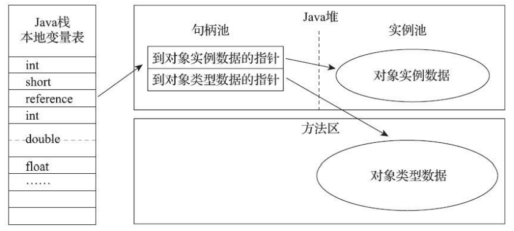
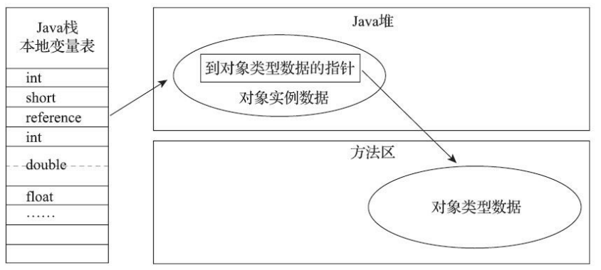

此处描述HotSpot在Java堆中对象分配、布局与访问的过程。
## 对象的创建
对于使用关键字new创建的普通Java对象（不包括复制、反序列化创建的对象和数组、Class对象）的执行过程如下。
当Java虚拟机遇到一条字节码new指令时，首先将去检查这个指令的参数是否能在常量池中定位到一个类的符号引用，并检查这个符号引用代表的类是否已被**加载、解析、初始化**，如果没有，必须先执行相应的类加载过程。
通过类加载检查后，虚拟机将为新对象分配内存。对象所需的内存在类加载完成后并可以确定，为对象分配空间的任务实际上等同于把一块确定大小的内存从堆中划分出来。如果堆是绝对规整的，空闲的内存在一边，已使用的在另一边，那么只需要把分界点的指针向未分配的那边挪动一段等于对象大小的距离即可，这种分配被称为**指针碰撞**。如果内存不是规整的，那么就必须维护一个列表，记录哪些内存是已使用的，哪些是空闲的，在分配的时候找出一块足够大的空间划分给对象实例，然后更新列表的记录，这种方式被称为**空闲列表**。采取哪种分配方式由堆是否规整决定，而堆是否规整取决于垃圾收集器是否包括压缩整理（Compact）的功能。如ParNew、Serial就拥有这个功能，使用这两种收集器时，采用的分配算法就是指针碰撞，既简单又高效，但是在垃圾收集时会有额外的开销；而当使用CMS这种基于Sweep算法的收集器时，理论上只能采用较为复杂的空闲列表来分配内存[1]。
另一个问题是对象创建是一个非常频繁的操作，在并发情况下不是线程安全的，解决这个问题有两种方案：

1. 对分配内存空间的操作进行同步处理--实际上虚拟机是采用CAS+失败重试的方式保证更新操作的原子性；
2. 将内存分配动作按线程划分在不同的空间之中进行，即每个线程在堆中预先分配一块内存，称为**本地内存分配缓冲（Thread Local allocation buffer, TLAB）**，分配内存时线程在本地缓冲区分配，只有本地缓冲区内存不够了，分配新的缓冲区时才需要同步锁定。虚拟机是否使用TLAB，可以通过-XX:+/-UseTLAB参数来设定。

内存分配完成后，虚拟机需要将分配到的内存空间（不包括对象头）初始化为零值，如果使用TLAB，那么可以在分配TLAB时就初始化。这步操作保证了对象的成员变量在Java代码中不用赋初始值就可以使用，程序可以访问到这些对象的零值。
接下来Java虚拟机需要对对象进行必要的配置，如这个对象是哪个类的示例，如何找到类的元数据信息，对象的哈希码（这一步在真正调用Object::hashCode()时才计算）、对象的GC分代年龄等。**这些信息存放在对象头中**。根据虚拟机当前运行状态不同，如是否启用偏向锁等，对象头会有不同的设置。
上面的步骤之后，在虚拟机的层面，一个新的对象已经产生，但是从Java程序的角度来说，对象创建才刚刚开始---构造函数，即Class文件中的&lt;init&gt;()方法还没有执行，所有的字段都是默认的零值，对象需要的其他资源和状态信息还没有按照预定的意图构造好。 **一般来说**（由字节 码流中new指令后面是否跟随invokespecial指令所决定，Java编译器会在遇到new关键字的地方同时生成 这两条字节码指令，但如果直接通过其他方式产生的则不一定如此），**new指令之后会接着执行 &lt;init&gt;()方法，按照程序员的意愿对对象进行初始化，这样一个真正可用的对象才算完全被构造出来。 **
代码逻辑大致如下：
```java
if (!constants->tag_at(index).is_unresolved_klass()) {
    // 断言确保是klassOop和instanceKlassOop（这部分下一节介绍）
    oop entry = (klassOop) *constants->obj_at_addr(index);
    assert(entry->is_klass(), "Should be resolved klass");
    klassOop k_entry = (klassOop) entry;
    assert(k_entry->klass_part()->oop_is_instance(), "Should be instanceKlass");
    instanceKlass* ik = (instanceKlass*) k_entry->klass_part();
    // 确保对象所属类型已经经过初始化阶段
    if ( ik->is_initialized() && ik->can_be_fastpath_allocated() ) {
        // 取对象长度
        size_t obj_size = ik->size_helper();
        oop result = NULL;
        // 记录是否需要将对象所有字段置零值
        bool need_zero = !ZeroTLAB;
        // 是否在TLAB中分配对象
        if (UseTLAB) {
        result = (oop) THREAD->tlab().allocate(obj_size);
    }
    if (result == NULL) {
        need_zero = true;
    // 直接在eden中分配对象
    retry:
        HeapWord* compare_to = *Universe::heap()->top_addr();
        HeapWord* new_top = compare_to + obj_size;
        // cmpxchg是x86中的CAS指令，这里是一个C++方法，通过CAS方式分配空间，并发失败的
        话，转到retry中重试直至成功分配为止
        if (new_top <= *Universe::heap()->end_addr()) {
        if (Atomic::cmpxchg_ptr(new_top, Universe::heap()->top_addr(), compare_to) != compare_to) {
        goto retry;
        }
        result = (oop) compare_to;
        }
    }
    if (result != NULL) {
    // 如果需要，为对象初始化零值
        if (need_zero ) {
            HeapWord* to_zero = (HeapWord*) result + sizeof(oopDesc) / oopSize;
            obj_size -= sizeof(oopDesc) / oopSize;
            if (obj_size > 0 ) {
            	memset(to_zero, 0, obj_size * HeapWordSize);
            }
        }
        // 根据是否启用偏向锁，设置对象头信息
        if (UseBiasedLocking) {
            result->set_mark(ik->prototype_header());
        } else {
            result->set_mark(markOopDesc::prototype());
        }
        result->set_klass_gap(0);
        result->set_klass(k_entry);
        // 将对象引用入栈，继续执行下一条指令
        SET_STACK_OBJECT(result, 0);
        UPDATE_PC_AND_TOS_AND_CONTINUE(3, 1);
        }
    }
}

```
:::info
[1]： 强调“理论上”是因为在CMS的实现里面，为了能在多数情况下分配得更快，设计了一个叫作Linear Allocation Buffer的分配缓冲区，通过空闲列表拿到一大块分配缓冲区之后，在它里面仍然可以使用指针碰撞方式来分配。  
:::
## 对象的内存布局
在HotSpot虚拟机中，对象存储布局可以分为3部分：**对象头、实例数据、对齐填充。**

- **对象头**

对象头包括两类信息。
第一类是用于存储对象自身的运行时数据，如**哈希码、GC分代年龄、锁状态标志、线程持有的锁、偏向线程ID、偏向时间戳等**，这部分被称为Mark Word。
另一类是类型指针，及对象指向它的类型元数据的指针，Java虚拟机通过该指针确认对象是哪个类的实例。不是所有的虚拟机实现都需要在对象头保存类型指针，[查找对象的元数据信息不一定要经过对象本身](111)。**如果对象是一个Java数组，那对象头里必须有一块用于记录数组长度的信息**，对象的大小可以通过元数据信息确定，而数组的长度是无法推断出来的。

- **实例数据**

对象真正存储的有效信息，即在程序代码里定义的各种类型的字段内容，无论是从父类继承下来的还是子类中自己定义的都会被记录下来。这部分的存储顺序受虚拟机分配策略参数（-XX: FieldAllocationStyle）和字段在源码中定义的顺序影响。HotSpot默认分配顺序为：longs/doubles, ints, shorts/chars, bytes/booleans, oops，相同宽度的总被分配到一起存放，在满足这个前提条件的情况下，在父类中定义的变量会出现在子类之前。如果HotSpot虚拟机的 +XX：CompactFields参数值为true（默认就为true），那子类之中较窄的变量也允许插入父类变量的空隙之中，以节省出一点点空间。  

- **对齐填充**

HotSpot的自动内存管理要求对象的起始地址必须是8字节的整数倍，如果没有对齐的话，就会通过对齐填充来补全。

## 对象的访问定位
Java程序通过栈上的reference数据来操作堆上的具体对象。规范中没有规定引用应该通过什么方式去定位、访问堆中的对象，所以这由具体的虚拟机决定。主要的访问方式有两种：

1. 使用句柄访问：Java堆中需要划分出一块内存来作为句柄池，reference存储的就是对象的句柄地址，而**句柄中包含了对象实例数据和类型数据****各自****的具体地址信息**。结构如下图所示。

<div align='center'></div>
通过句柄访问对象

2. 直接指针访问：使用直接指针访问的话，Java内存就必须考虑如何放置访问类型数据的相关信息，reference中存储的就是对象地址，如果只是访问**对象本身**的话，就不用多一次间接访问的开销（指reference --&gt; 句柄 --&gt; 对象），结构如下所示。

<div align='center'></div>
通过直接指针访问对象
## 优缺点

- 句柄：使用句柄最大的好处是reference存储的是稳定的句柄地址，在对象被移动是时只会改变句柄中的实例数据指针，而reference本身无需修改。
- 直接指针：好处就是速度快，在只访问对象实例数据的情况下节省了一次指针定位的开销，对于频繁的对象访问操作来说，可以节约可观的开销。

HotSpot主要用第二种方式进行对象访问 （有例外情况，如果使用了Shenandoah收集器的 话也会有一次额外的转发），但从整个软件开发的范围来看，在各种语言、框架中，使用句柄来访问的情况也十分常见。  
