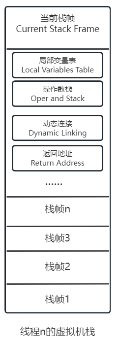

# 栈帧结构
在不同的虚拟机实现中，执行引擎在执行字节码的时候，通常会有解释执行（通过解释器执行）和编译执行（通过即时编译器产生的本地代码执行）两种选择，也可能两种兼备，甚至可能会有同时包含几个不同级别的即时编译器一起工作的执行引擎。但是从外观看，所有的Java虚拟机执行引擎的输入输出一致：输入的是字节码二进制流，处理过程时字节码解析执行的等效过程，输出的是执行结果。

## 运行时栈帧结构
Java虚拟机以方法作为最基本的运行单元，栈帧是方法调用和方法执行的数据结构。**栈帧存储了局部变量表、操作数栈、动态连接、方法返回地址和一些额外的附加信息**。每个方法的调用与执行结束对应的就是一个栈帧入栈到出栈的过程。在**编译源码时栈帧需要多大的局部变量表和多深的操作数栈已经被计算出来，记录在方法表的Code属性中，其中max_locals数据项中确定了需要分配的局部变量表的最大容量**。
## 局部变量表
一组变量值的存储空间，用于存放方法参数和方法内部定义的局部变量。局部变量表的容量以变量槽为最小的单位，规范中只指明一个变量槽能存放一个boolean、byte、short、char、int、float、reference、或returnAddress类型的数据，这8中数据类型可以用32位或更小的物理内存来存储。对于64位的数据类型，Java中只有long和double两种，一般将其分割为两个32位存储，类似“long和double的非原子性协定”将其读写分为两次32位操作。**因为局部变量表在栈中，而栈是线程私有的，所以无论两次连续的变量槽读写操作是否是原子操作，都不会有数据竞争和线程安全问题。**
虚拟机通过索引定位方式使用局部变量表。当一个方法被调用时，虚拟机通过局部变量表实现实参到形参的传递，如果执行的是实例方法，局部变量表第0位索引的变量槽存放的是对象实例的引用，类似方法中的this，其余参数按序排列。
## 操作数栈
操作数栈也叫操作栈。和局部变量表一样，操作数栈的深度在编译的时候被写入高Code属性的max_stacks数据项中。**操作数栈的每一个元素都可以是包括long和double在内的任意数据类型。32位数据类型的栈容量为1，64位的为2**。一个方法开始执行时，操作数栈是空的，在方法执行过程中，会有各种字节码指令往操作数中写入和提取内容。
 Java虚拟机的解释执行引擎被称为“基于栈的执行引擎”，里面的“栈”就是操作数栈。  
## 动态连接
**每个栈帧都包含一个指向运行时常量池中该栈帧所属方法的引用**，持有这个引用是为了支持调用过程中的动态链接。Class文件的常量池中有大量的符号引用，字节码的方法调用指令就以常量池里指向方法的符号引用作为参数。这些符号引用一部分会在类加载阶段或第一次使用的时候就被转化为直接引用，这种转换被称为静态解析。另一部分将在每一次有运行期间都转化为直接引用，这部分被称为动态连接。
## 方法返回地址
一个方法开始执行后，有两种退出方法的方式：

- 正常调用完成(Normal Method Invocation Completion)：执行引擎遇到任意一个方法返回的字节码指令，可能会有返回值传递给上层的服务调用者（主调方法），方法是否有返回值以及返回值的类型取决于遇到何种方法返回指令。
- 异常调用完成（Abrupt Method Invocation Completion）：方法执行过程中遇到了异常，并且这个异常没有在方法体内得到妥善处理。无论是Java虚拟机内部产生的异常还是代码中使用athrow字节码指令产生的异常（throw or throws），只要在本方法的异常表中没用匹配的异常处理器，就会导致方法退出。异常退出的方法不会给主调方法提供返回值。

不论是何种方式退出，退出之后都必须返回该方法被调用时的位置。方法返回时可能需要在栈帧中保存一些信息，用来帮助恢复他的上层主调方法的执行状态。一般来说，**正常退出时，主调方法的PC计数器的值就可以作为返回地址，栈帧中很可能保存这个计数器值。异常退出时，返回地址要通过异常处理器表来确定，栈帧中一般不保存这部分信息。**
方法退出等同于栈帧出栈，一次退出时可能执行的操作有：

- 恢复上层方法的局部变量表和操作数栈
- 将返回值压入主调方法的操作数栈
- 调整PC计数器的值以指向方法调用指令后一条指令
- 具体取决于虚拟机具体实现
## 附加信息
《Java虚拟机规范》允许虚拟机实现增加一些规范里没有描述的信息到栈帧，如调试、性能收集相关的信息，完全取决于具体的虚拟机实现。动态链接、方法返回地址和附加信息可以统称为栈帧信息。
