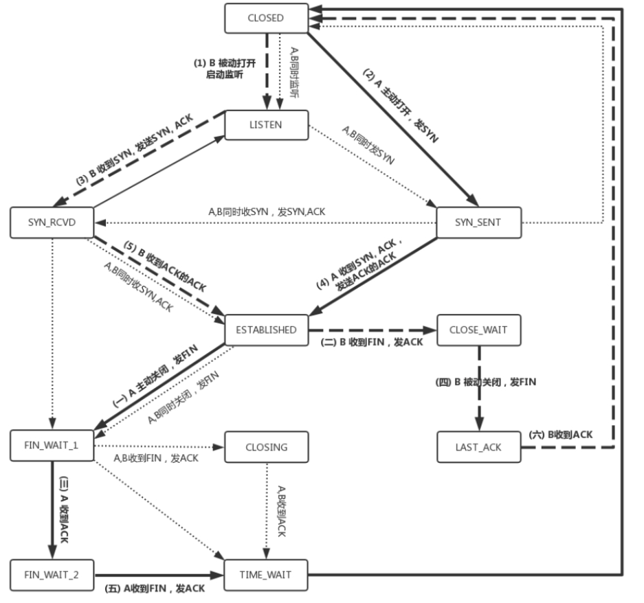

# 网络协议

## 问题

### TCP三次握手的时候，IP层和MAC层在做什么
三次握手就是发送请求，每一次发送请求都需要经过IP层、MAC层。在网络中传输的所有包都是完整的，任何包都不可能有上层部分而没有下层部分。
整个传输网络中的链路中的设备所做的工作都是讲接收到的包拆开一部分，查看自己需要做的是转发、丢弃、收下。

### MAC头和IP头的细节

**MAC头**
显示目的MAC地址和源MAC地址，然后是协议类型，**协议类型是用来说明里面是IP协议的。**
**IP头**

- 版本：IPv4、IPv6
- 服务类型TOS：数据包按服务类型被分配到三个波段。代表了当前包是高优先级还是低优先级的。
- TTL：这个包的生存时间
- 协议：下一层协议TCP还是UDP
- 源IP地址、目标IP地址
#### 访问一个IP地址的流程

1. 通过子网掩码判断是否在同一个局域网，如果在直接通过ARP协议获取对方MAC地址，将两个MAC放入MAC头发出即可。
2. 如果不在。通过ARP协议获取网关的MAC地址，塞入源MAC和目标MAC，发出去，被网关接收到。一般网关都是一个路由器，路由器是一个三层设备，即会将MAC头和IP头都拿下来看一下要转发给哪里，而交换机是一个二层设备。
3. 路由器从一个口接收到之后，拿下MAC头和IP头，检查发给哪里，然后根据自己的路由算法从另一个口发出去。**路由分为取决于静态路由还是动态路由**。
4. 如果两个局域网网段没有冲突，就只需要更改MAC地址，否则MAC地址和IP地址都会被改变
5. 在MAC地址需要改变的情况下，会在出当前局域网的时候将源IP地址改为网关的IP地址，防止源IP和对方局域网的IP冲突。**而这个IP地址改变的过程就是Network Address Translation**，简称**NAT**。
#### 静态路由和动态路由
**静态路由**
静态路由就是根据在路由器上配置的规则，决定当前数据包要从几号口出去，下一站去哪里。
**动态路由算法**
通过路由器之间的交流，绘制出路由的图，根据最短路径算法，计算出路由的最短距离。当有多个最短路由路径时，就在这多个路径中进行负载均衡。
> 链路状态算法：当一个路由器启动的时候，首先是发现邻居，向邻居say hello，邻居都回复。然后计算和邻居的距离，发送一个echo，要求马上返回，除以二就是距离。然后将自己和邻居之间的链路状态包广播出去，发送到整个网络的每个路由器。这样每个路由器都能够收到它和邻居之间的关系的信息(此时路由器是知道邻居能访问某个路由器是否通过自己，从而可以判断能否通过其他路由器访问一个自己无法访问的路由器)。因而，每个路由器都能在自己本地构建一个完整的图，然后针对这个图使用Dijkstra算法，找到两点之间的最短路径。
> 路由器之间会通过UDP报文进行路由信息的交换 。

#### 关于ifconfig
Linux除了ifconfig可以查看地址，也可以用ip addr命令。
##### IP地址
子网掩码用来判断是否属于同一个子网，如果是同一个子网，可以直接通过MAC地址定位完成通信。
<div align='center'></div>

- LOWER_UP：插着网线(此处没有)
- BROADCAST：网卡有广播地址，可以发送广播包
- MULTICAST：可以发送多播包
- MTU 1500：最大传输单元，以太网的默认值是1500，**以太网规定连MAC头带正文合起来，不允许超过1500个字节，正文里面有IP的头、TCP的头、HTTP的头。如果放不下，就需要分片来传输**。
#### 配置IP地址
使用ifconfig
```shell
$ sudo ifconfig eth1 10.0.0.1/24
$ sudo ifconfig eth1 up
```
	使用ip addr
```shell
$ sudo ip addr add 10.0.0.1/24 dev eth1
$ sudo ip link set up eth1
```
> IP是不能胡乱配置的，配置错了会导致发不出信息。


## 协议
### DHCP 动态主机配置协议
DHCP是为了方便的分配IP地址，有了DHCP后，只需要配置一段共享的IP地址，每有一台新的设备接入的时候，就向共享IP地址申请，自动配置好就可以，当时设备断开时，将他用的IP放回到共享IP地址里。
#### 解析DHCP的方式

1. DHCP Discover

当一个设备第一次来一个网络时，只知道自己的mac地址。此时机器使用IP地址0.0.0.0发送一个广播包，目的地址255.255.255.255。广播包封装了UDP，UDP封装了BOOTP(DHCP)就是BOOTP的增强版。

2. DHCP Offer

DHCP Server发现有设备接入，判断MAC地址是不是没有的，将一个IP地址分配给新设备并不再将此IP分给其他设备。

如果网络中有多个DHCP Server服务，那么新设备就会接收到很多服务，一般会选择最先到的作为自己的IP，然后广播一条DHCP Request数据包，包中包含客户端的MAC地址，接受的租约中的IP地址，提供此租约的DHCP服务器的地址，并告诉所有DHCP Server它将接受那个服务器提供的IP，以便其他服务器撤销他们提供的IP，供后续的设备使用。
当DHCP Server接收到客户机的DHCP Request后，会**广播**返回一条DHCP ACK消息包，并将该IP的信息放入该广播包，发给客户机。**租约达成后，客户机开始使用该IP，并广播一条数据让该网络下所有设备都知道该IP的加入。**
#### IP续租
当IP租期过去一半后，客户机会向为其提供IP的DHCP Server发送DHCP Request请求续期，DHCP Server会将续期的具体信息返回给客户机。

#### PXE
DHCP 可以通过PXE协助主机安装操作系统。在云计算环境下很好用。
### ARP 地址解析协议
ARP是一个数据链路层协议，目的是通过IP地址获取MAC地址。具体逻辑就是广播询问所有设备这个IP是谁的，把你的MAC发出来。为了避免每次都广播，也会做ARP缓存，不过机器不断上下线，ARP缓存一段时间就会过期。
### RARP 逆向地址解析协议
允许局域网的物理机器从网关服务器的ARP表或缓存上请求IP地址。如果一台设备只知道自己的MAC地址而不知道IP地址，就可以通过RARP获取自己的IP地址。
### ICMP 网络控制报文协议
ICMP有两种类型，一种是查询报文，另一种是差错报文。
ping是基于ICMP的。网络包在网络环境传输时会遇到各种问题，不能死的不明不白，要传出消息，报告情况，以便发送方可以调整传输策略。
ICMP报文封装在IP包里，本身非常简单。类型有很多，最常用的是主动请求为8，主动请求的应答为0。
ping就是查询报文，是一种主动请求，并能获得主动应答的ICMP协议，只不过在后面增加了自己的格式。
**查询报文类型**
对ping的**主动请求**抓包得到的是ICMP ECHO REQUEST，主动请求的回复成为ICMP ECHO REPLY。和原生ICMP相比多了两个字段

- 标识符：区分这次执行的命令的目的。
- 序号：校验发出的命令是否全部返回。
- 还会存放请求的时间值，计算往返时间，说明路程的长短。

**差错报文类型**
差错报文目的是标识失败的原因，例如：终点不可达为3，源抑制为4，超时为11，重定向为5。
**ping命令执行过程**
<div align='center'></div>
> ping使用的是查询报文。traceroute使用的是差错报文，发送的是udp的数据包，因为udp是无连接的，所以需要发送对方不能接收的数据，让对方给你响应才能知道本次传输的信息。

### UDP & TCP

- UDP是面向无连接的，TCP是面向连接的。
- TCP提供可靠交付，传输的数据无差错、不丢失、不重复、按序到达；而UDP不保证不丢失，不保证按顺序到达。
- TCP面向字节流，UDP基于数据报，一个一个发，一个一个收。
- TCP有拥塞控制，通过滑动窗口实现，可以自行调节发送的速率。UDP不会，只会埋头发包。TCP是有状态的，知道包发送之后的情况，UDP只管发包，发了之后就不管了。

**字节流和数据报**
TCP分多少次读取字节流和发送方发送了多少次没有关系。
UDP和TCP不同，发送端调用了几次write，接收端必须用相同次数的read读完。UPD是基于报文的，在接收的时候，每次最多只能读取一个报文，报文和报文是不会合并的，如果缓冲区小于报文长度，则多出的部分会被丢弃。也就说，如果不指定MSG_PEEK标志，每次读取操作将消耗一个报文。
#### UDP

当一个设备到达目标地址后，首先匹配MAC地址，如果匹配，查看包内的IP地址，如果也匹配，通过UDP头的目的端口号交给对应得应用程序，剩下的就由应用程序自己处理了。UDP默认可以送达，没有拥塞控制，无论是否丢包，该怎么发还怎么发。
**UDP的适用场景**

1. 需要资源少，网络情况较好，对丢包不敏感的应用
2. 不需要一对一沟通，建立连接；而是可以广播的应用。**DHCP就是一种广播形式，就是基于UDP的**。
3. 需要处理速度快、时延低的时候。可以自己在应用层实现建立连接、拥塞控制等。
#### TCP


- 源端口号和目标端口号不可少。
- 序号是为了解决乱序的问题
- 确认序号：用来确认已经发送出去的包
- 状态位：SYN是发起一个连接。ACK是回复，RST是重新连接，FIN是结束连接等。TCP是面向连接的，这些带状态为的包的发送，会引起双方的状态变更。
- 窗口大小：TCP做流量控制的方式，通信双方各自声明一个滑动窗口大小，表明自己的处理能力。	
- 拥塞控制：控制自己发送的速度。
##### TCP连接
**三次握手**
三次握手发起方A得到了响应，响应方B也得到了响应，确认连接建立成功。除了建立连接，**A还要告诉B自己发的包序号从哪个序号开始，B也要告诉A自己发送的包会从哪个序号开始。**如果都从1开始的话，每次重新连接都会从头开始发，如果有上次发送的延迟比较高，对方接收到后就会产生冲突。
**连接建立过程中双方状态变化图**
<div align='center'></div>
**四次挥手**
<div align='center'></div>
##### TCP状态机

##### 超时重传问题
根据接收端的滑动窗口的大小，发送端会将需要发送的包分为：

- 已经发送并确认的
- 已经发送但未确认的
- 准备发送的
- 暂时不会发送的
> 第2、3部分取决于对方滑动窗口的大小。

> 如果接收方序号1，2，3，4，5已经确认，6，7等待接收，8，9已经接收但还没有ack；假设5的确认包发送方没收到，6，7的数据包丢了，有两种方法：
>
> 1. 超时重试
>
>    ​	当5，6，7的确认包超时了还没有接收到，就会重新发送，接收方发现5接收过了，就会将这个包丢了，6收到了，就返回ack，如果7又丢了。需要重传时，TCP的策略是超时时间翻倍。两次超时说明网络不好，不适合频繁发送。
>    超时重传的缺点是超时周期可能很长，不够快
>
> 2. 快速重传
>
>     例如，接收方发现6、8、9都已经接收了，就是7没来，那肯定是丢了，于是发送三个6的ACK，要求下一个是7。客户端收到3个，就会发现7的确又丢了，不等超时，马上重发


##### 滑动窗口
### HTTP
有1.1和2.0两个版本，没啥好说的。注意首部字段
#### HTTPS
在HTTP的基础上增加了加密的步骤，同时经过国家认证的证书，服务器在建立连接过程中将证书发给客户端，客户端通过证书和权威机构来验证公钥的合法性。
### QUIC Quick UDP Internet Connections
### 流媒体协议
### RPC 远程
## 设备
### 交换机
为了防止每次都发给所有设备，交换机在转发包的时候记录下每个口对应的MAC地址，下次收到发往这个MAC地址的包，就无须发给出来源外的所有口，直接发给记录中的MAC地址对应的口就可以了。这个记录MAC地址和对应得口的就是**转发表**。但是IP和口在不断变化，所以转发表也是有过期时间的。
#### 环路问题
当两台交换机将两个局域网同时连接起来时，就出现环路问题。
<div align='center'></div>
> 机器1要访问机器2，因为不知道机器2的MAC地址，就需要发起一个ARP的广播，机器2 会返回自己的MAC地址，但是两个交换机都收到了广播，交换机A不知道机器2在哪个局域网，九八广播消息放到局域网二，结果导致交换机B从右边收到了广播消息，交换机B会将这个消息广播到局域网一，交换机A从左边接收到这个广播，又将其广播到局域网二，如此循环往复......
> 并且环路的传递会破坏交换机学会的拓扑结构。

**如何破除环路呢？**
STF 生成树协议。没有环的图就是树。	
**如何解决网络体量变大广播导致性能损失的问题**
VLAN 虚拟机局域网，将设备隔离在虚拟局域网下，减少网络中传播的广播数量。支持VLAN的交换机，在传输包时，属于VLAN N的包只会被转发到VLAN N的口。
